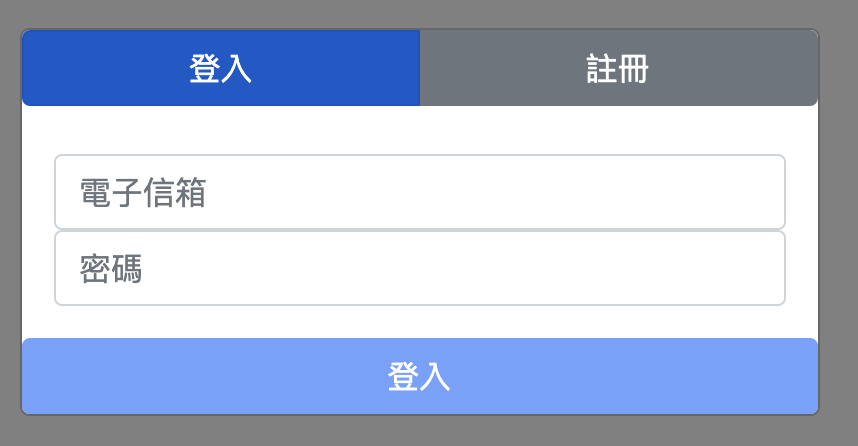
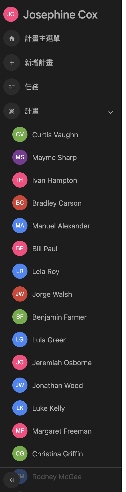
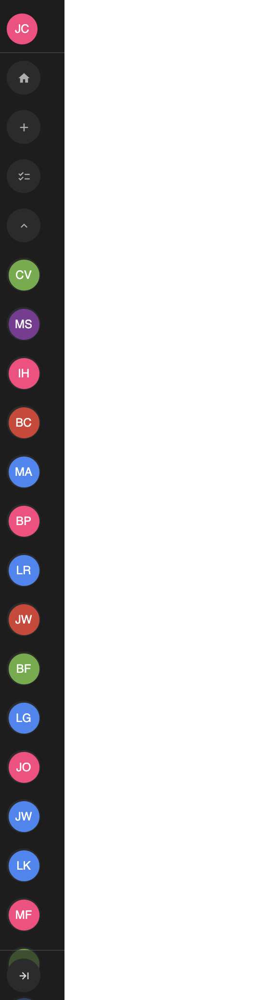
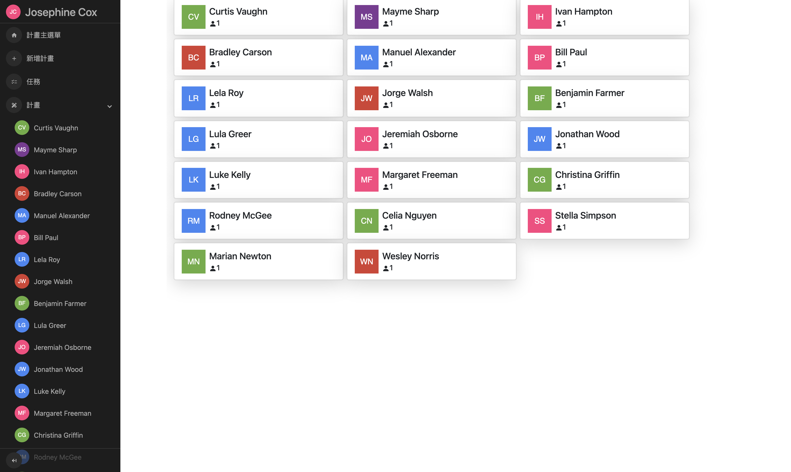
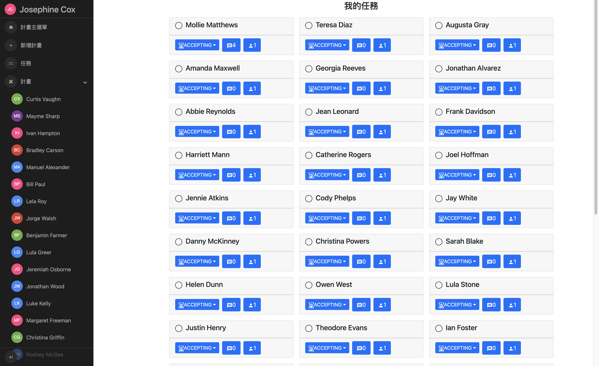
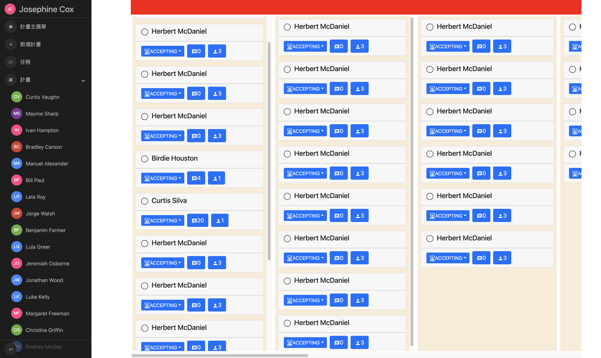
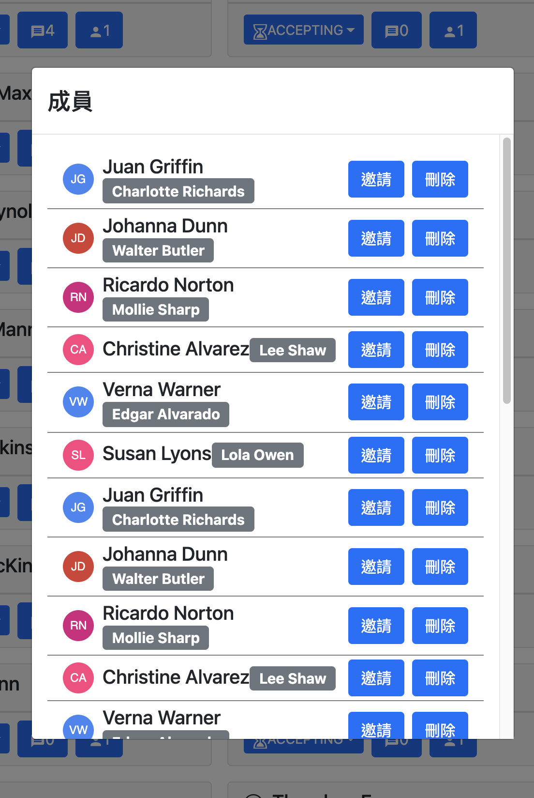

## 計畫儀表板

計畫與任務管理，使用React、Redux、Graphql等技術

## 介紹

- 登入入口

- 側扁選單

- 計畫列表

- 我的任務與計畫的任務

- 成員與評論

## Learn More

To learn more about Next.js, take a look at the following resources:

- [Next.js Documentation](https://nextjs.org/docs) - learn about Next.js features and API.
- [Learn Next.js](https://nextjs.org/learn) - an interactive Next.js tutorial.

You can check out [the Next.js GitHub repository](https://github.com/vercel/next.js/) - your feedback and contributions are welcome!

## Deploy on Vercel

The easiest way to deploy your Next.js app is to use the [Vercel Platform](https://vercel.com/new?utm_medium=default-template&filter=next.js&utm_source=create-next-app&utm_campaign=create-next-app-readme) from the creators of Next.js.

Check out our [Next.js deployment documentation](https://nextjs.org/docs/deployment) for more details.

任務看板

功能：
-使用者註冊
-使用者驗證
-建立任務
-刪除任務
-修改任務（狀態、合作者、評論、公開）
-預覽任務（自身、他人）
-預覽活動（自身、他人）
