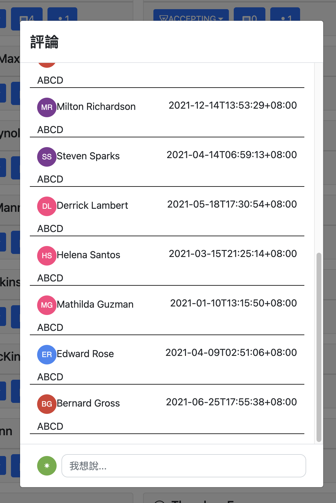

## 計畫儀表板

計畫與任務管理，使用React、Redux、Graphql等技術，還有部分未完成待調整與研究

[後端專案](https://github.com/Slipromise/plan-dashboard-graphql)

## 介紹

- 登入入口

- 側扁選單

- 計畫列表

- 我的任務與計畫的任務

- 成員與評論

## Todo

- [ ] 滾動式查詢的Component或Hook獨立模塊
- [ ] 整理無用與重複代碼
- [ ] bootstrap調整主題
- [ ] 英文語系添加
- [ ] Eslint設定調整
- [ ] Rtk-query 無效/有效標籤設定
- [ ] Storybook + Chromatic 實作
